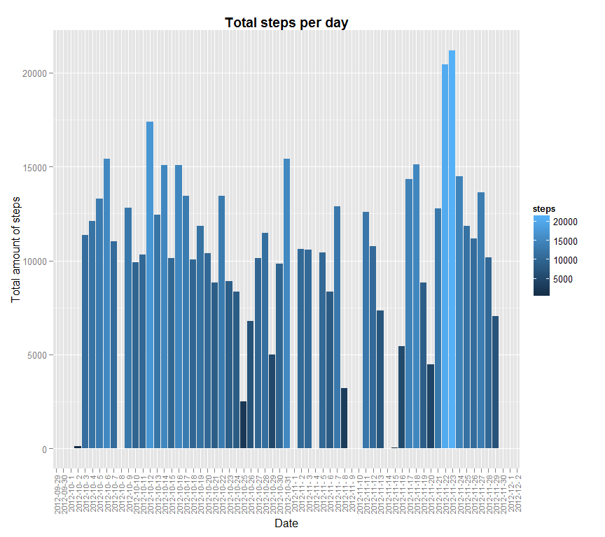
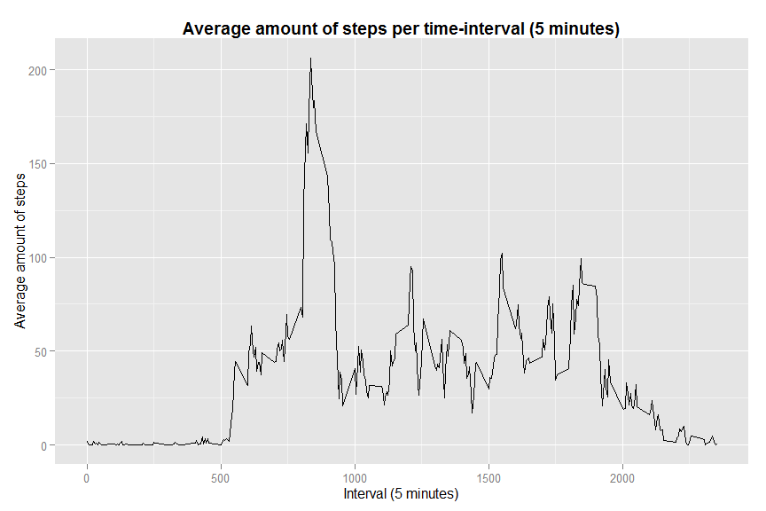
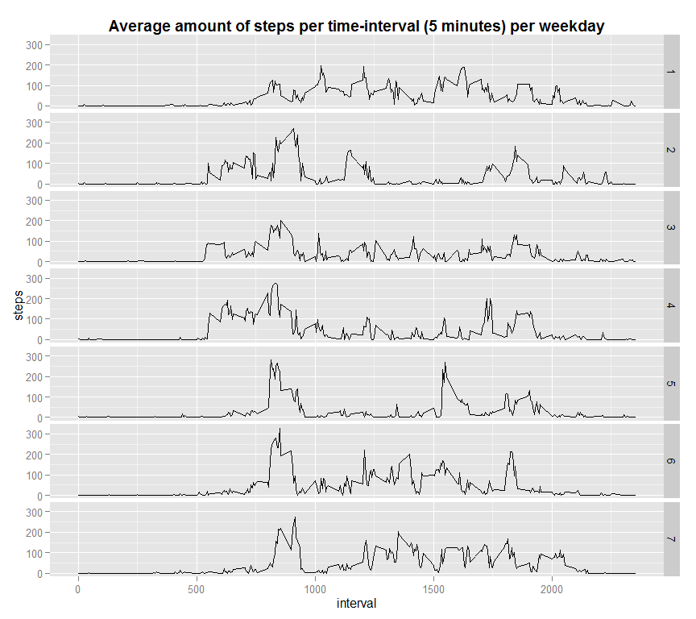
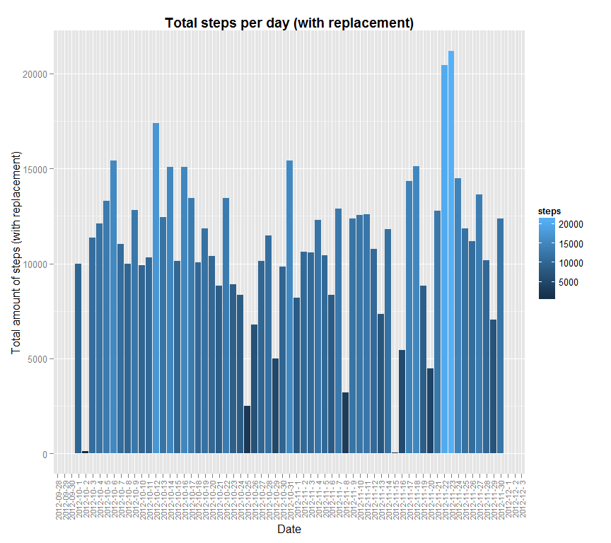
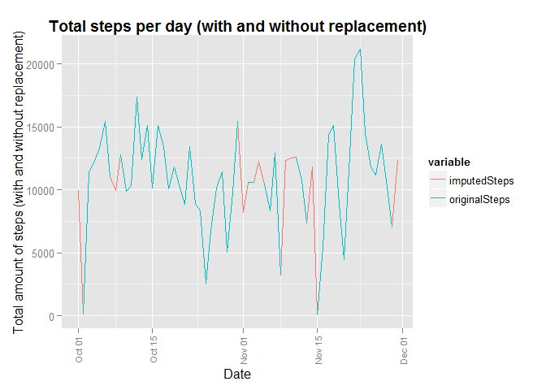
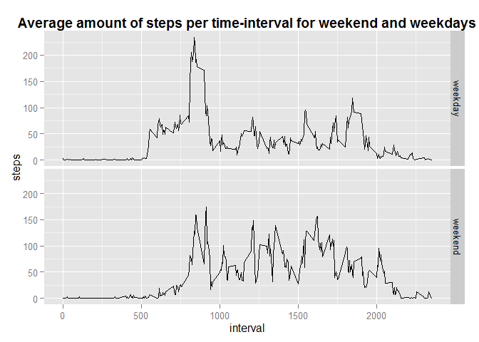

# Reproducible Research: Peer Assessment 1


## Loading and preprocessing the data
Load the required libraries

```r
library(ggplot2)
library(lubridate)
library(scales)
```
Load the data

```r
unzip(zipfile='activity.zip')
activity=read.csv("activity.csv")
```
## Process/transform the data (if necessary) into a format suitable for your analysis
Let's first view the summary of the data

```r
summary(activity)
```

```
##      steps                date          interval     
##  Min.   :  0.00   2012-10-01:  288   Min.   :   0.0  
##  1st Qu.:  0.00   2012-10-02:  288   1st Qu.: 588.8  
##  Median :  0.00   2012-10-03:  288   Median :1177.5  
##  Mean   : 37.38   2012-10-04:  288   Mean   :1177.5  
##  3rd Qu.: 12.00   2012-10-05:  288   3rd Qu.:1766.2  
##  Max.   :806.00   2012-10-06:  288   Max.   :2355.0  
##  NA's   :2304     (Other)   :15840
```
Furthermore, let's check the classes of the various variables

```r
class(activity$steps)
```

```
## [1] "integer"
```

```r
class(activity$date)
```

```
## [1] "factor"
```

```r
class(activity$interval)
```

```
## [1] "integer"
```

## transformations
As we have observed, "date" doesn't have the right format.

```r
activity$date  <-as.Date(strptime(activity$date,"%Y-%m-%e"))
```

## What is mean total number of steps taken per day?
First we calculate the total number of steps taken per day and ignore the missing values.

```r
totalSteps <- aggregate(steps ~ date, data=activity, FUN=sum,na.rm=TRUE)
```
Then we make a histogram of the total number of steps taken each day

```r
ggplot(totalSteps, aes(x=date, y=steps, group=date, fill=steps) ) + 
  geom_bar(stat="identity", position = "stack") +
  xlab("Date") + ylab("Total amount of steps") +
  scale_x_date(labels = date_format("%Y-%m-%e"), breaks = date_breaks("day")) +
  ggtitle("Total steps per day") + 
  theme(axis.text.x = element_text(angle = 90, vjust = 0.5, hjust=1, size=8), 
        plot.title = element_text(lineheight=.8, face="bold"))
```

 

Calculate and report the **mean** and **median** total number of steps taken 
per day 


```r
mean(totalSteps$steps)
```

```
## [1] 10766.19
```

```r
median(totalSteps$steps)
```

```
## [1] 10765
```
* The **mean** total number of steps taken per day is 
    1.0766189\times 10^{4} steps.
* The **median** total number of steps taken per day is 
    10765 steps.

## What is the average daily activity pattern?
We make a time series plot of the 5-minute interval (x-axis) and the average number of steps taken, averaged across all days (y-axis). Therefore we first aggregate the steps per interval.

```r
stepsInterval <- aggregate(steps ~ interval, data=activity, FUN=mean)

ggplot(stepsInterval, aes(interval, steps)) + geom_line() +
   xlab("Interval (5 minutes)") + ylab("Average amount of steps") + 
  ggtitle("Average amount of steps per time-interval (5 minutes)") +
  theme(plot.title = element_text(lineheight=.8, face="bold"))
```

 

There is not much activity for the first interval, probably because people are sleeping. Now we will obtain the interval with the most amount of steps.

```r
stepsInterval$interval[which.max(stepsInterval$steps)]
```

```
## [1] 835
```
* The **highest** amount of steps taken per interval is 
    835 steps.
    
## Imputing missing values
### 1.Calculate and report the total number of missing values in the dataset

```r
missingValues <- sum(is.na(activity$steps))
missingValues
```

```
## [1] 2304
```

### 2.Devise a strategy for filling in all of the missing values in the dataset. 
To impute the missing values, we will investigate the difference per day of the week. 

```r
activity$weekday <- as.factor(wday(activity$date))
summary(activity$weekday)
```

```
##    1    2    3    4    5    6    7 
## 2304 2592 2592 2592 2592 2592 2304
```

```r
activity$daytype <- as.factor(sapply(activity$weekday,function(weekend) if (weekend ==7 | weekend==1) 'weekend' else 'weekday'))
summary(activity$daytype)
```

```
## weekday weekend 
##   12960    4608
```

```r
# check interval per weekday
stepsIntervalWeekday <- aggregate(steps ~ interval + weekday, data=activity, FUN=mean)

# plot
ggplot(stepsIntervalWeekday, aes(interval, steps)) + 
  geom_line(stat="identity") +
  facet_grid(weekday~.) +
  ggtitle("Average amount of steps per time-interval (5 minutes) per weekday") +
  theme(plot.title = element_text(lineheight=.8, face="bold"))
```

 

We observe a difference for some days, so we will impute the missing values, based on the interval and the day of the week.


```r
activityReplaceMissing <- merge(activity, stepsIntervalWeekday, 
                                by = c("interval","weekday"),
                                suffixes=c("",".y"))
```

### 3.Create a new dataset that is equal to the original dataset but with the missing data filled in.

```r
missing <- is.na(activityReplaceMissing$steps)
activityReplaceMissing$steps[missing] <- activityReplaceMissing$steps.y[missing]
```

### 4.Make a histogram of the total number of steps taken each day and calculate and report the mean and median total number of steps taken per day. Do these values differ from the estimates from the first part of the assignment? What is the impact of imputing missing data on the estimates of the total daily number of steps?

**Total steps per day**

```r
totalStepsAll <- aggregate(steps ~ date, data=activityReplaceMissing, FUN=sum)

ggplot(totalStepsAll, aes(x=date, y=steps, group=date, fill=steps) ) + 
  geom_bar(stat="identity", position = "stack") +
  xlab("Date") + ylab("Total amount of steps (with replacement)") +
  scale_x_date(labels = date_format("%Y-%m-%e"), breaks = date_breaks("day")) +
  ggtitle("Total steps per day (with replacement)") + 
  theme(axis.text.x = element_text(angle = 90, vjust = 0.5, hjust=1, size=8), 
        plot.title = element_text(lineheight=.8, face="bold"))
```

 

**mean and median of the total number of steps taken per day**

```r
mean(totalSteps$steps)
```

```
## [1] 10766.19
```

```r
mean(totalStepsAll$steps)
```

```
## [1] 10821.21
```

```r
median(totalSteps$steps)
```

```
## [1] 10765
```

```r
median(totalStepsAll$steps)
```

```
## [1] 11015
```
Here we see a small difference in the mean and median of the original data and the imputed data.
We can visualize this per date to show the differences.

```r
steps <- merge(totalStepsAll, totalSteps, 
                                by = "date",
                                suffixes=c("",".y"),all=TRUE)

names(steps) <- c("date","imputedSteps","originalSteps")

ggplot(steps, aes(date, color = variable)) + 
  geom_line(aes(y = imputedSteps, col = "imputedSteps")) + 
  geom_line(aes(y = originalSteps, col = "originalSteps")) +
  ggtitle("Total steps per day (with and without replacement)") +
  xlab("Date") + ylab("Total amount of steps (with and without replacement)") +
  theme(axis.text.x = element_text(angle = 90, vjust = 0.5, hjust=1, size=8), 
        plot.title = element_text(lineheight=.8, face="bold"))
```

```
## Warning in loop_apply(n, do.ply): Removed 2 rows containing missing values
## (geom_path).
```

 

## Are there differences in activity patterns between weekdays and weekends?

```r
stepsIntervalDaytype <- aggregate(steps ~ interval + daytype, data=activity, FUN=mean)

# plot
ggplot(stepsIntervalDaytype, aes(interval, steps)) + 
  geom_line(stat="identity") +
  facet_grid(daytype~.) +
  ggtitle("Average amount of steps per time-interval for weekend and weekdays") +
  theme(plot.title = element_text(lineheight=.8, face="bold"))
```

 

There are some differences between weekdays and weekends. People might sleep a little longer on weekends compared to weekdays.
